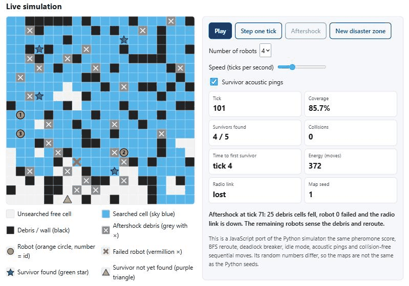
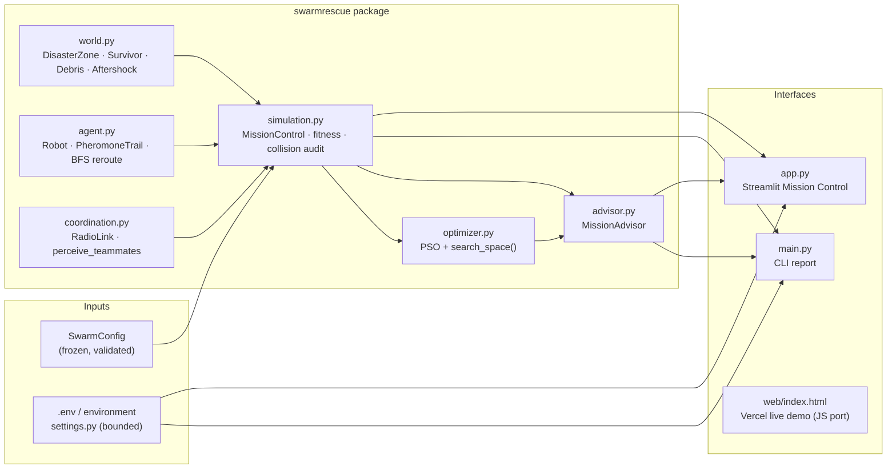
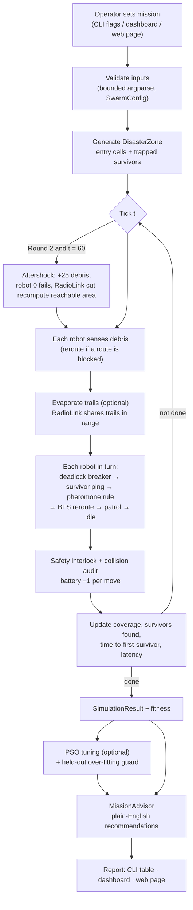
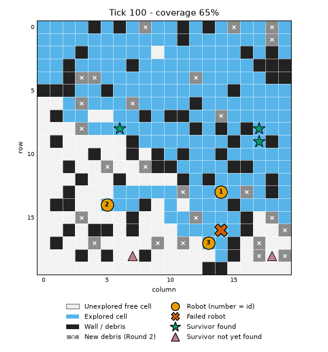

# SwarmRescue

**Decentralized Ant-Pheromone Multi-Robot Exploration for Disaster Zone Search & Rescue**

After an earthquake, a swarm of rescue robots enters a collapsed building and must search every
reachable cell to find trapped survivors. There is no central controller: each robot decides its
next move from its own sensors, a digital **pheromone trail** of cells already searched, trails
shared over a short-range **radio link**, and the **acoustic pings** of survivors it can hear.
Particle Swarm Optimisation (PSO) tunes the behaviour weights, and a rule-based **Mission Advisor**
turns the results into plain-English advice for the human operator.



---

## Demo

| | Link | Notes |
|---|---|---|
| **Primary demo (loads instantly)** | **Vercel:** `https://YOUR-PROJECT.vercel.app` *(replace with the deployed URL)* | [`web/index.html`](web/index.html) is a single 25 KB page with a live JavaScript port of the swarm, an **Aftershock** button, live metrics and the real results table. It makes no network requests. |
| Full Mission Control dashboard | **Streamlit:** `https://YOUR-APP.streamlit.app` *(replace with the deployed URL)* | [`app.py`](app.py) runs the Python simulator with PSO tuning and the Mission Advisor. It may take a while to wake up on a free tier, which is why the Vercel page is the primary demo. |
| Demo video | *Coming soon: add the video link here* | |
| Source | https://github.com/venkatreddy3/swarmrescue | |

**Deploying the Vercel page:** import the repository into Vercel, set **Root Directory = `web`** and
**Framework Preset = Other**, and leave the build command empty. [`web/vercel.json`](web/vercel.json)
adds a strict Content-Security-Policy (hash-pinned inline script and style) and other security headers.
To try it locally, run `python -m http.server 8765 --directory web` and open http://localhost:8765.

---

## Chosen Vertical

**Track 05: Intelligent Systems & Autonomous Computing** (OptiForge 2026).

The project combines several computational-intelligence techniques:

- **Ant Colony-style stigmergy** (pheromone trails, now with **evaporation**) for decentralized,
  self-organising search.
- **Particle Swarm Optimisation** for automatic parameter tuning, with an over-fitting guard.
- **A rule-based expert system** (Mission Advisor) for explainable decision support.

---

## Problem Statement

A collapsed building (the **disaster zone**) is modelled as an occupancy grid (`0` = free,
`1` = debris or wall). `N` rescue robots start at the entry point. They must:

1. **Achieve coverage.** Search as much of the reachable free space as possible, as quickly as possible.
2. **Find survivors.** Locate trapped survivors hidden in reachable cells, and reach the first one fast.
3. **Stay collision-free.** Never collide with debris or with each other.
4. **Save energy.** Every move costs 1 battery unit, and a robot stops at 0.
5. **Tolerate failure.** In **Round 2**, an **aftershock** at tick 60 drops 25 new debris cells that
   the robots are not told about. Robot 0 fails permanently and the radio link goes down. The swarm
   must have **no single point of failure**, and robots must **reroute** around the new debris.

The mission score is:

```
fitness = 100*coverage + 20*survivors_found_ratio + 20*speed - 0.01*energy_moves - 100*collisions
speed   = 1 - tick_at_90pct_coverage / MAX_TICKS      (0 if 90% coverage is never reached)
```

`coverage` = searched reachable cells / reachable free cells. The reachable area is recomputed after
the aftershock. We also report **time-to-first-survivor** and the time until *every* survivor is found.

---

## SDG Alignment

| UN Sustainable Development Goal | How SwarmRescue contributes |
|---|---|
| **SDG 9: Industry, Innovation and Infrastructure. Target 9.4:** upgrade infrastructure and industries with clean, efficient technology | Swarm robotics lets inspection and rescue work continue inside damaged infrastructure without putting people at risk. The swarm is **energy-efficient**: the fitness penalises every move, robots go idle when nothing is left to search, and PSO cuts wasted moves (Round 1: 572 → 538 moves on seeds 1–3). Decentralized control keeps working after a robot or radio failure, which makes the automation itself **resilient**. |
| **SDG 11: Sustainable Cities and Communities. Target 11.5:** significantly reduce the number of deaths and people affected by disasters | Survival after a building collapse falls sharply with time, so the key outputs are the **time-to-first-survivor** and the **time until every survivor is found**. Acoustic pings cut the average time to reach every survivor from 103 to 66 ticks (Round 1) and from 158 to 97 ticks (Round 2), on 20 zones. **Coverage** close to 100% means no room is left unsearched, and survivors found rose from 96% to 99% in Round 2. |

In short: **coverage** means no one is overlooked, **time-to-survivor** means people are reached
sooner, and **energy use** means longer missions per battery with less hardware.

---

## Approach & Algorithmic Logic

### 1. Ant-pheromone move rule (each robot, every tick)

Each `Robot` has a private `PheromoneTrail`. It scores every free 4-neighbour and moves to the one
with the **lowest** score:

```
score(cell) = PHEROMONE_WEIGHT * pheromone[cell]
            + SPREAD_WEIGHT    * Σ_teammates 1 / (1 + manhattan(cell, teammate))   # crowding
            + RANDOMNESS       * U(0, 1)                                            # tie-break noise
```

- The **pheromone** term steers robots away from cells that have already been searched. This is
  ant-colony *stigmergy*: coordinating through marks left in the environment.
- The **crowding** term pushes robots apart so they fan out into different rooms.
- The **noise** term breaks symmetric ties.

### 2. BFS reroute

If every neighbour has already been searched, the robot runs **breadth-first search** over its own
known-free cells to the **nearest unsearched** cell and takes the first step. On an unweighted grid,
BFS returns a true shortest path; a test checks this against an independent Bellman-Ford computation.
Teammates the robot can perceive count as obstacles, so it reroutes around them. When nothing is left
to search in its belief, the robot goes **idle** to save battery.

### 3. Adaptive feature A: pheromone evaporation (`use_evaporation`, `EVAPORATION_RATE`)

Real ant trails fade over time. With evaporation on, each robot's trail decays every tick:
`pheromone *= (1 − EVAPORATION_RATE)`. The robot still remembers which cells it has searched. There
are two effects:

- The pheromone score prefers cells searched **long ago** over cells searched recently.
- An idle robot **patrols** back to *stale* cells, meaning searched cells whose pheromone has
  dropped below 0.05, instead of standing still.

`EVAPORATION_RATE` is added to the PSO search space (range 0–0.2) when the flag is on. It is **off by
default**. On its own it is roughly neutral: Round 2 fitness went 117.63 → 117.80 on 20 zones.
Combined with PSO it gave the **best Round 2 result on unseen maps** (121.03; see Results).

### 4. Adaptive feature B: survivor acoustic pings (`use_pings`, `PING_RANGE`)

Trapped survivors tap on debris or have a phone signal. Each unfound survivor emits a ping that a
robot within `PING_RANGE` (Manhattan distance; sound passes through rubble) can hear. A robot that
hears a ping **gives it priority**. It plans a BFS route to the source that treats unknown cells as
passable and avoids known debris. Its first step is always a known-free cell that no one occupies, so
movement stays collision-free. The sensor corrects the plan as the robot moves. **On by default**
(range 4). The metric **`first_survivor_tick`** (time-to-first-survivor) is reported everywhere.

### 5. Safety and robustness

- **Collision-free by construction.** Robots move one at a time within each tick. A robot never enters
  debris or a cell that is occupied or already claimed, including a failed robot's cell. So two robots
  can never swap places. `MissionControl` also runs an independent safety interlock and audits every
  tick for shared cells, robots on debris and head-on swaps.
- **Deadlock breaker.** A robot blocked for 3 ticks takes a random free neighbour.
- **Reroute after debris.** Each robot scans its surroundings within `SENSE_RANGE` every tick. Debris
  that fell on a known route is found as soon as the robot is nearby, and BFS reroutes immediately.
- **Energy and battery.** Each move costs 1, and a robot stops permanently at 0.

### 6. Decentralization: no single point of failure

- Each robot owns its own `known` map and `PheromoneTrail`. It never reads the ground truth, only its
  sensor window.
- **`RadioLink`.** Robots within `COMM_RANGE` merge trails and debris maps with an element-wise
  maximum. Merging is single-hop and order-independent. After the aftershock cuts the radio, robots
  only perceive teammates within 2 cells and no longer share maps.
- `MissionControl` is only the simulator and observer: it owns the clock, the ground truth and the
  audit. It never sends a robot an order.

### 7. PSO tuning with an over-fitting guard

PSO searches `PHEROMONE_WEIGHT ∈ [0,3]`, `SPREAD_WEIGHT ∈ [0,3]` and `RANDOMNESS ∈ [0,1]`, plus
`EVAPORATION_RATE ∈ [0,0.2]` when evaporation is on. It uses 8 particles, 12 iterations, inertia 0.6
and c1 = c2 = 1.5. Fitness is **averaged over seeds 1, 2 and 3**. Particle 0 starts at the defaults,
so the best-fitness history never goes down; a test checks this.

**New in Attempt 2:** the CLI re-evaluates the tuned weights on **10 held-out maps** (seeds 101–110).
It only recommends them if held-out fitness does not drop (`main.generalizes`).

### Why these CI techniques?

| Need | Technique | Why it fits |
|---|---|---|
| Search without a leader, survive robot or radio loss | Ant-colony stigmergy + evaporation | Local rules produce global coverage, and losing a robot degrades performance gradually instead of stopping the mission. Evaporation lets old information fade. |
| Fill gaps when local marks run out, reroute around new debris | BFS | Gives the shortest path on unweighted grids, and is cheap enough to rerun every tick |
| Reach survivors sooner | Acoustic-ping homing | Turns a weak, long-range cue into a direct route to the person |
| Tune continuous weights for a noisy, simulation-based objective | PSO | Needs no gradients or model of the objective, and is itself a swarm-intelligence method |
| Explainable operator guidance offline | Rule-based expert system | Deterministic, auditable, and needs no network or API keys |

---

## Architecture



## End-to-End Flow



---

## How to Run

Requires Python 3.11+ (developed on 3.13).

```bash
pip install -r requirements.txt
```

**CLI**

```bash
python main.py --round 1                      # static building, seeds 1 2 3
python main.py --round 2                      # aftershock + robot failure + radio loss
python main.py --round 2 --tune               # PSO + before/after + held-out over-fitting check
python main.py --round 2 --evaporation --tune # also tune EVAPORATION_RATE
python main.py --round 2 --no-pings           # Attempt 1 behaviour (no acoustic pings)
python main.py --agents 6 --battery 150 --wall-density 0.25 --priority speed
python scripts/ablation.py                    # pings / evaporation ablation on 20 zones
```

Every numeric flag is range-checked. For example, `--agents 0`, `--particles 999` and
`--wall-density nan` are rejected with exit code 2.

**Optional settings.** Copy [`.env.example`](.env.example) to `.env` to change `SWARM_SEED` (the
default seeds) or `LOG_LEVEL`. No secrets are needed anywhere; see [SECURITY.md](SECURITY.md).

**Tests** (148 tests, about 15 s)

```bash
python -m pytest
```

**Streamlit dashboard**

```bash
streamlit run app.py
```

**Web demo locally**

```bash
python -m http.server 8765 --directory web
```



**Accessibility.** Both the dashboard and the web page use the colour-blind-safe **Okabe-Ito**
palette, and every element also has a distinct **shape** and a text legend:

| Element | Shape | Colour |
|---|---|---|
| Robot (with its id) | circle | orange |
| Failed robot | X | vermillion |
| Survivor found | star | green |
| Survivor not yet found | triangle | purple |
| Aftershock debris | grey cell with a white "x" | grey |

The web page also provides:
- semantic landmarks and a skip link;
- keyboard-operable `<button>`s with visible focus and at least 44 px targets;
- labelled controls;
- a canvas `aria-label` that describes the map in text, updated every tick;
- an `aria-live` status line for key events;
- light and dark themes;
- `prefers-reduced-motion`: the animation does not start automatically.

---

## Results

These are real outputs of `python main.py --round N --tune` and `python scripts/ablation.py` with the
default configuration (Windows 11, Python 3.13). Everything is seeded, so all metrics except
wall-clock latency are reproducible.

### Attempt 2 defaults (pings on, evaporation off), seeds 1–3

| Round | Weights | Coverage | Survivors | 1st survivor (tick) | 90% coverage (tick) | Energy | Collisions | Fitness |
|---|---|---|---|---|---|---|---|---|
| 1 | default | 1.000 | 15/15 | 21.3 | 110 | 572 | 0 | **126.950** |
| 1 | PSO-tuned | 1.000 | 15/15 | 16.7 | 98 | 538 | 0 | **128.061** |
| 2 | default | 0.967 | 15/15 | 21.3 | 175 | 807 | 0 | **116.937** |
| 2 | PSO-tuned | 0.998 | 15/15 | 17.7 | 133 | 792 | 0 | **123.016** |

Per seed (default → tuned):

| Round | Seed | Coverage | 1st survivor | 90% coverage | Energy | Fitness |
|---|---|---|---|---|---|---|
| 1 | 1 | 1.000 → 1.000 | 18 → 14 | 106 → 105 | 599 → 566 | 126.943 → 127.340 |
| 1 | 2 | 1.000 → 1.000 | 8 → 8 | 101 → 95 | 515 → 555 | 128.117 → 128.117 |
| 1 | 3 | 1.000 → 1.000 | 38 → 28 | 123 → 95 | 601 → 494 | 125.790 → 128.727 |
| 2 | 1 | 0.993 → 0.997 | 18 → 21 | 152 → 125 | 806 → 808 | 121.153 → 123.260 |
| 2 | 2 | 0.957 → 0.997 | 8 → 8 | 225 → 149 | 808 → 808 | 112.572 → 121.653 |
| 2 | 3 | 0.951 → 1.000 | 38 → 24 | 149 → 124 | 808 → 760 | 117.085 → 124.133 |

Tuned weights: Round 1 `pheromone=1.085, spread=1.254, randomness=0.721`; Round 2
`pheromone=0.527, spread=2.590, randomness=0.541`. Each PSO run takes about 15 s. The maximum decision
latency for the whole swarm is usually 1–4 ms per tick. One run had a 19.6 ms Windows scheduling spike,
still under the 50 ms budget, which a test also checks.

Convergence log excerpts (verbatim):

```
# Round 1
[PSO] iter  0 | best  126.950 | swarm mean  124.656 | pheromone_weight=1.000, spread_weight=0.500, randomness=0.100
[PSO] iter  2 | best  128.049 | swarm mean  126.930 | pheromone_weight=1.010, spread_weight=1.480, randomness=0.593
[PSO] iter 10 | best  128.061 | swarm mean  127.357 | pheromone_weight=1.085, spread_weight=1.254, randomness=0.721
[PSO] iter 12 | best  128.061 | swarm mean  127.485 | pheromone_weight=1.085, spread_weight=1.254, randomness=0.721
# Round 2 (a random initial particle was already best)
[PSO] iter  0 | best  123.016 | swarm mean  115.364 | pheromone_weight=0.527, spread_weight=2.590, randomness=0.541
[PSO] iter 12 | best  123.016 | swarm mean  119.165 | pheromone_weight=0.527, spread_weight=2.590, randomness=0.541
```

**Over-fitting check (held-out seeds 101–110).** With pings on, the tuned weights **did not
generalize**. Held-out fitness went 127.180 → 126.955 (Round 1) and 120.258 → 118.212 (Round 2).
The CLI's new over-fitting guard therefore keeps the default weights and does not recommend the
tuned ones:

```
Over-fitting guard: tuned weights score lower on held-out maps, so the advisor keeps the default weights.
```

### Innovation ablation: 20 disaster zones (`python scripts/ablation.py`)

**Round 1**

| Variant | Coverage | Survivors | 1st survivor | All survivors found | 90% coverage | Energy | Collisions | Fitness |
|---|---|---|---|---|---|---|---|---|
| Attempt 1 baseline (no pings, no evaporation) | 1.000 | 100.0% | 16.5 | 103.2 | 103.4 | 561 | 0 | 127.49 |
| + evaporation only (rate 0.01) | 1.000 | 100.0% | 16.5 | 101.2 | 102.8 | 565 | 0 | 127.49 |
| **+ acoustic pings (default)** | 1.000 | 100.0% | **11.3** | **65.7** | 107.0 | 579 | 0 | 127.08 |
| + pings + evaporation | 1.000 | 100.0% | 11.3 | 65.7 | 106.6 | 580 | 0 | 127.09 |

**Round 2 (aftershock)**

| Variant | Coverage | Survivors | 1st survivor | All survivors found | 90% coverage | Energy | Collisions | Fitness |
|---|---|---|---|---|---|---|---|---|
| Attempt 1 baseline (no pings, no evaporation) | 0.969 | 96.0% | 16.5 | 157.8 | 159.6 | 783 | 0 | 117.63 |
| + evaporation only (rate 0.01) | 0.969 | 97.0% | 16.5 | 159.3 | 161.0 | 780 | 0 | 117.80 |
| **+ acoustic pings (default)** | **0.980** | **99.0%** | **11.3** | **97.0** | 153.3 | 790 | 0 | **119.65** |
| + pings + evaporation | 0.975 | 98.0% | 11.3 | 94.7 | 154.2 | 795 | 0 | 118.89 |

**Round 2 on held-out seeds 101–110** (from the `--tune` runs):

| Variant | Coverage | Survivors | 1st survivor | 90% coverage | Energy | Fitness |
|---|---|---|---|---|---|---|
| Attempt 1 (no pings), default weights | 0.973 | 94% | 13.9 | 176.7 | 779 | 116.50 |
| Pings (Attempt 2 default), default weights | 0.982 | 100% | 8.5 | 155.4 | 762 | 120.26 |
| Pings + evaporation 0.01, default weights | 0.985 | 100% | 8.5 | 162.5 | 778 | 119.92 |
| **Pings + evaporation, PSO-tuned (4 params)** | 0.982 | 100% | **8.1** | **137.9** | 793 | **121.03** |

**Takeaways**

- **Pings are the big win for rescue.** Survivors are reached about **31% sooner on average**
  (16.5 → 11.3 ticks for the first survivor), and **every survivor is found 36–39% sooner**. Round 2
  survivors found rose from 96% to 99%. In Round 1, fitness drops by 0.4, because the formula doesn't
  reward reaching people sooner, but it does charge for the extra moves.
- **Evaporation is a context-dependent tool, not a default.** On its own it is neutral. With PSO
  tuning the rate (`--evaporation --tune`), it gives the best Round 2 result on unseen maps (121.03)
  and reaches 90% coverage 18 ticks sooner than pings alone.
- **Zero collisions** in every run: 20 zones × 4 variants × 2 rounds, plus the test suite. The JS port
  also passes a headless Node test of 16 maps with zero collisions.
- **Honest limitation:** PSO on only 3 seeds over-fits. The guard now catches this, and the README
  reports it rather than hiding it.

Mission Advisor output of `python main.py --round 2 --tune` (after the guard):

```
[INFO] Speed up the search: 90% coverage takes about 175 ticks. More robots and a stronger spread term reach it sooner. -> try num_agents=5, spread_weight=0.8
[INFO] Robots are revisiting cells: About 2.8 moves per explored cell. Without radio, robots cannot share pheromone maps and re-search each other's areas; restoring map sharing helps most.
[INFO] Plan for failures: Round 2 lost a robot and the radio link. Keep a spare robot in reserve and consider dropping radio relays so robots can keep sharing maps.
[SUCCESS] Mission on track: 97% coverage, 100% of survivors found, zero collisions.
```

<details>
<summary>Attempt 1 results (before pings), kept for comparison</summary>

| Round | Weights | Coverage | Survivors | 90% coverage | Energy | Collisions | Fitness |
|---|---|---|---|---|---|---|---|
| 1 | default | 1.000 | 100% | 105 | 593 | 0 | 127.092 |
| 1 | PSO-tuned | 1.000 | 100% | 99 | 537 | 0 | 128.049 |
| 2 | default | 0.979 | 100% | 143 | 807 | 0 | 120.314 |
| 2 | PSO-tuned | 0.985 | 100% | 123 | 756 | 0 | 122.749 |

On seeds 1–3, Round 2 default fitness was higher in Attempt 1 (120.31) than in Attempt 2 (116.94),
because pings pull robots toward survivors on those particular maps. Across 20 zones and on the
held-out maps, pings raise Round 2 fitness (117.63 → 119.65 and 116.50 → 120.26). We report both.
</details>

---

## Parameter Configuration

All parameters live in the frozen dataclass `SwarmConfig` (`swarmrescue/config.py`). Out-of-range or
wrongly typed values raise `ValueError`.

| Parameter | Default | Valid range | Meaning |
|---|---|---|---|
| `grid_size` | 20 | 5–100 | Side length of the disaster zone |
| `wall_density` | 0.18 | 0–0.45 | Initial debris fraction |
| `num_agents` | 4 | 1–20 | Rescue robots |
| `num_survivors` | 5 | 0–50 | Trapped survivors |
| `max_ticks` | 300 | 1–5000 | Mission time limit |
| `battery` | 250 | 1–100000 | Energy (moves) per robot |
| `comm_range` | 5 | 1–2·grid | Manhattan radio-link range |
| `sense_range` | 1 | 1–5 | Chebyshev debris-sensor radius |
| `pheromone_weight` | 1.0 | 0–3 | Pheromone penalty (PSO-tuned) |
| `spread_weight` | 0.5 | 0–3 | Crowding penalty (PSO-tuned) |
| `randomness` | 0.1 | 0–1 | Noise amplitude (PSO-tuned) |
| `shift_tick` | 60 | ≥ 0 | Aftershock tick (Round 2) |
| `new_walls` | 25 | 0–grid²/4 | Aftershock debris cells |
| `use_evaporation` | False | bool | Pheromone evaporation on/off |
| `evaporation_rate` | 0.01 | 0–0.2 | Pheromone fraction lost per tick (PSO-tuned when on) |
| `use_pings` | True | bool | Survivor acoustic pings on/off |
| `ping_range` | 4 | 1–10 | Distance at which a robot hears a survivor |
| `seed` | 0 | ≥ 0 | Master seed (zone, survivors, noise, aftershock) |

Environment settings (`.env`, optional): `SWARM_SEED` (0–10000, default 1) and `LOG_LEVEL`
(DEBUG, INFO, WARNING, ERROR or CRITICAL; default WARNING).

---

## Assumptions & Operational Constraints

- **Grid world.** Robots use 4-connected moves, one cell per tick, and each move costs 1 battery unit.
- **Entry point.** Robots start at the reachable cells closest to the top-left corner. Zones whose
  reachable area is below 40% of the free space are regenerated.
- **Survivors.** A survivor counts as found when a robot enters their cell. Pings stop once a survivor
  is found. The survivor ratio counts all survivors, including any that the aftershock cuts off.
- **Acoustic pings** carry position (a direction and distance estimate) but not a route. The robot
  still has to find a way through the rubble with its own sensors.
- **Sensing.** Debris sensing is perfect within the square window. Robots never see the full map.
- **Round 2 coverage.** The reachable area is the free cells connected to a working robot (the failed
  robot counts as an obstacle), plus cells already searched that are still free.
- **Radio link.** Single-hop within `comm_range`, with no latency or packet loss while it works. After
  it fails, robots only perceive teammates within 2 cells, and no trails are merged.
- **Failed robots** stay in place as permanent obstacles.
- **Latency** is wall-clock time for the swarm's sense, share and decide cycle in one tick. It depends
  on the machine; a test enforces a 50 ms budget.
- **Determinism.** A given `(config, seed)` always produces the same mission. The web demo uses its own
  RNG, so its maps differ from the Python seeds.
- **Security and privacy.** Everything runs locally and offline, with no API keys; see
  [SECURITY.md](SECURITY.md).

---

## Attempt Notes

### Attempt 2 (score 67.17 → this revision)

**Summary:** added a fast Vercel demo because the Streamlit URL timed out in the latency probe;
renamed the code to domain terms for problem alignment; added pheromone evaporation and survivor pings
for innovation; added `.env.example`, `SECURITY.md` and an SDG section.

1. **Efficiency: instant-load Vercel page.** The auditor's probe timed out on the Streamlit URL
   (free-tier cold start), so [`web/index.html`](web/index.html) is now the primary demo.
   - It is a single 25 KB file with inline CSS and JS, no frameworks and no network requests.
   - It runs a live JavaScript port of the swarm with an Aftershock button.
   - `web/vercel.json` adds a hash-pinned CSP.
   - A headless Node test runs the page's own JavaScript on 16 maps and asserts zero collisions.
2. **Problem alignment: domain vocabulary.** Classes and functions now use the language of the
   problem: `DisasterZone`, `Survivor`, `Debris`, `Aftershock`, `Robot`, `PheromoneTrail`,
   `RadioLink`, `MissionControl`, `MissionAdvisor`, `sense_debris`, `drop_aftershock_debris`,
   `share_pheromone_trails` and `_reroute`. The refactor changed no behaviour: the CLI results were
   bit-identical before and after (127.092 and 120.314).
3. **Innovation: two adaptive features, each behind a config flag with tests.**
   - **Pheromone evaporation.** Trails fade and stale areas get re-patrolled. `EVAPORATION_RATE` joins
     the PSO search space.
   - **Survivor acoustic pings.** Robots home in on survivors they hear, and the new
     time-to-first-survivor metric is reported everywhere.
   - `scripts/ablation.py` measures both on 20 zones.
4. **Honest finding: PSO over-fits.** With pings on, weights tuned on 3 seeds scored *lower* on held-out
   maps. We added an over-fitting guard (`main.generalizes`) so the advisor never recommends weights
   that fail on unseen maps.
5. **Security.**
   - [`swarmrescue/settings.py`](swarmrescue/settings.py) loads `SWARM_SEED` and `LOG_LEVEL` from
     `.env` or the environment. It reads only known keys, bounds and allow-lists every value, and
     never crashes on bad input.
   - New files: `.env.example` and [`SECURITY.md`](SECURITY.md).
   - Every CLI flag has explicit bounds (seed lists and PSO budgets are capped against resource
     exhaustion), and all dashboard inputs are bounded widgets.
   - A test scans all tracked files for credential-like strings.
6. **Docs and accessibility.**
   - Added the SDG 9 and SDG 11 section, Mermaid architecture and end-to-end diagrams, two screenshots
     under `docs/`, and a Demo section.
   - The dashboard legend no longer overlaps the axis label.
   - The dashboard gained adaptive-feature toggles and a time-to-first-survivor metric.

### Attempt 1

1. **Baseline swarm.** Pheromone score, BFS fallback, deadlock breaker, sequential collision-free
   moves and `np.maximum` map merging. 100% coverage and 0 collisions in Round 1.
2. **Idle mode instead of endless wandering.** This cut wasted moves and let missions stop early,
   which made PSO fast (about 25 s).
3. **BFS routes around teammates.** Perceived robots are obstacles. The deadlock breaker is the last
   resort.
4. **Fairer Round 2 coverage.** The denominator keeps cells searched before the aftershock, and treats
   the failed robot as an obstacle.
5. **PSO seeded with the defaults and checked on held-out maps.**
6. **The advisor contradicted PSO** in Round 2, so the "revisiting cells" rule became round-aware.
7. **Dashboard readability.** Two-column metrics and integer axes.
8. **Test fix.** One hand-computed fitness assertion was wrong (97.0, not 92.0).

---

## Project Structure

```
swarmrescue/
├── swarmrescue/
│   ├── __init__.py
│   ├── config.py        # SwarmConfig frozen dataclass + validation, PSO bounds
│   ├── settings.py      # safe .env / environment loader (SWARM_SEED, LOG_LEVEL)
│   ├── world.py         # DisasterZone, Survivor, Debris, Aftershock, BFS, reachable(), drop_aftershock_debris()
│   ├── agent.py         # Robot, PheromoneTrail (evaporation), pheromone rule, BFS reroute, ping homing
│   ├── coordination.py  # RadioLink (trail sharing), perceive_teammates
│   ├── simulation.py    # MissionControl, simulate() -> SimulationResult, fitness, collision audit
│   ├── optimizer.py     # PSO with convergence log and flag-dependent search space
│   └── advisor.py       # MissionAdvisor rule-based recommendations
├── web/
│   ├── index.html       # instant-load Vercel demo (live JS port, no network requests)
│   └── vercel.json      # security headers + hash-pinned CSP
├── docs/                # screenshots (web-demo.png, dashboard-map.png)
├── scripts/ablation.py  # pings / evaporation ablation study
├── tests/               # 148 tests: world, agent, simulation, optimizer, advisor, evaporation,
│                        #   pings, security, CLI, Streamlit AppTest, web page (+ headless JS run)
├── main.py              # CLI
├── app.py               # Streamlit Rescue Mission Control
├── requirements.txt     # pinned dependencies
├── .env.example         # optional settings, no secrets
├── SECURITY.md
├── pytest.ini, .gitattributes, .gitignore, .streamlit/config.toml, .devcontainer/
├── LICENSE
└── README.md
```
